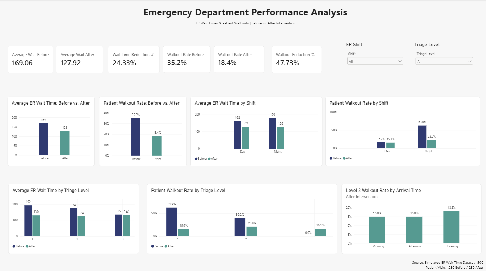

# Emergency Department Performance Analysis 

## Project Overview 
This project analyzes simulated emergency department patient data to evaluate changes in wait times and patient walkout rates before and after an intervention. 

The analysis was completed using Python and pandas for data preparation and exploratory analysis, followed by Power BI for dashboard development and interactive visualization. 

## Business Question 
Did the intervention improve emergency department performance by reducing patient wait times and walkout rates?

## Tools Used 
- Python
- pandas
- Jupyter Notebook
- Power BI
- DAX
- Power Query

 ## Dataset
 The project uses simulated emergency department data representing 500 patient visits:
 - 250 visits before the intervention 
 - 250 visits after the intervention

The dataset includes variables such as shift, triage level, staffing, wait time, patient walkout status, arrival time, age, and critical cases on shift. 

> This dataset is simulated and does not contain real patient information.

## Key Findings 
- Average ER wait time decreased from **168.06 minutes** to **127.92 minutes**.
- This represents a **24.33% reducation in average wait time**.
- Patient walkout rate decreased from **35.25%** to **18.4%**.
- This represents a **47.73% reduction in walkouts**.
- Night-shift performance showed a substantial improvemnet in patient walkout rates.
- Triage-level analysis showed that the impact of the intervention varied across patient acuity levels.

## Dashboard 

## Analysis Process 
1. Loaded and reviewed the before and after intervention datasets in Python.
2. Checked data shape, missing values, data types, and duplicate records.
3. Calculated summary statistics for wait time and patient walkouts.
4. Compared results by shift and triage level.
5. Combined the datasets into a single analysis file.
6. Imported the cleaned dataset into Power BI.
7. Created DAX measures for key performance indicators.
8. Built an interactive dashboard using slicers and before vs. after intervention comparisons.

## Dashboard Metrics 
The dashboard includes: 
- Average Wait Time Before
- Average Wait Time After
- Wait Time Reduction %
- Walkout Rate Before
- Walkout Rate After
- Walkout Reduction %

Additional visuals analyze performance by:
- Shift
- Triage level
- Arrival time

## Skills Demonstrated 
- Healthcare data analysis
- Data cleaning and validation
- Python and pandas
- Exploratory data analysis
- Power BI dashboard development
- DAX measures
- Power Query
- KPI development
- Data visualization
- Business insight communication 

## Conclusion 
The simulated intervention was associated with lower ER wait times and a substantial reduction in patient walkouts. The largest operational improvements were observed in areas that had higher baseline delays and walkout rates, highlighting the value of using data to identify opportunities for process improvement in emergency department operations. 

## Project Note 
This repository contains the public portfolio version of the project. The complete working project, including the full Jupyter Notebook, Python analysis, Power BI '.pbix' file, and additional development files, is maintained privately and available upon request. 

All data used in this project is simulated and contains no real patient or protected health information. 
